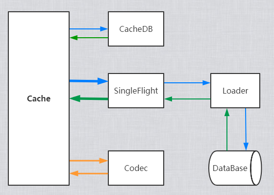

# 朴实无华的缓存模块

---

# 示例代码

```go
cache := zcache.NewCache() // 初始化示例

var a string
_ = cache.Query("test", &a, // 获取数据, 保存结果的变量必须是指针
    // 为query设置查询加载函数, 缓存未命中时执行这个加载函数生成数据, 生成的数据会自动存入缓存
    zcache.NewQueryConfig().LoaderFn(func(query core.IQuery) (interface{}, error) {
        // 在这里写入你的db逻辑
        return "hello", nil
    }),
)

fmt.Println(a)
```

# 结构图



# 流程图


# 获得

`go get -u github.com/zlyuancn/zcache`

# 支持的数据库

+ 支持任何数据库, 本模块不关心用户如何加载数据

# 支持的缓存数据库

+ [任何实现 `cachedb.ICacheDB` 的结构](./core/cachedb.go)
+ [no-cache](./cachedb/no-cache/no-cache.go)
+ [memory-cache](./cachedb/memory-cache/memory-cache.go)
+ [redis](./cachedb/redis-cache/redis-cache.go)

# 支持的编解码器

> 开发过程中不需要考虑每个对象的编解码, 可以在初始化时选择一个编解码器, 默认是`MsgPack`

+ [任何实现 `codec.ICodec` 的结构](./core/codec.go)
+ Byte
+ Json
+ JsonIterator
+ MsgPack
+ ProtoBuffer

# 如何解决缓存击穿

+ 可以在启用SingleFlight, 当有多个进程同时获取一个相同的数据时, 只有一个进程会真的去加载函数读取数据, 其他的进程会等待该进程结束直接收到结果. 可以通过 `core.ISingleFlight` 接口实现分布式锁让多个实例同一时间只有一个进程加载同一个数据.

# 如何解决缓存雪崩

+ 为加载器设置随机的TTL, 可以有效减小缓存雪崩的风险.

# 如何解决缓存穿透

+ 我们提供了一个占位符, 如果在loader结果中返回 `nil`, 我们会将它存入缓存, 当你在获取它的时候会收到错误 `errs.DataIsNil`
+ 在用户请求key的时候预判断它是否可能不存在, 比如判断id长度不等于32(uuid去掉横杠的长度)的请求直接返回数据不存在错误

# benchmark

> 未模拟用户请求和db加载, 直接测试本模块本身的性能

```shell script
go test -v -run "^$" -bench "^Benchmark.+$" -cpu 8,20,50,200,500 .
```

## 10 000 个key, 每个key 512字节随机数据, 请求key顺序随机

```text
CPU: 4c8t 3.7GHz
# memory-cache
BenchmarkMemoryCache_10k-8       	 3366450	       359 ns/op
BenchmarkMemoryCache_10k-20      	 3006697	       363 ns/op
BenchmarkMemoryCache_10k-50      	 3310576	       369 ns/op
BenchmarkMemoryCache_10k-200     	 3186573	       377 ns/op
BenchmarkMemoryCache_10k-500     	 2937687	       403 ns/op
# redis-cache
BenchmarkRedisCache_10k-8        	   50944	     23504 ns/op
BenchmarkRedisCache_10k-20       	   64591	     18694 ns/op
BenchmarkRedisCache_10k-50       	   60328	     17439 ns/op
BenchmarkRedisCache_10k-200      	   52489	     19878 ns/op
BenchmarkRedisCache_10k-500      	   36250	     30525 ns/op
```

# 示例

[传送门](./example)

